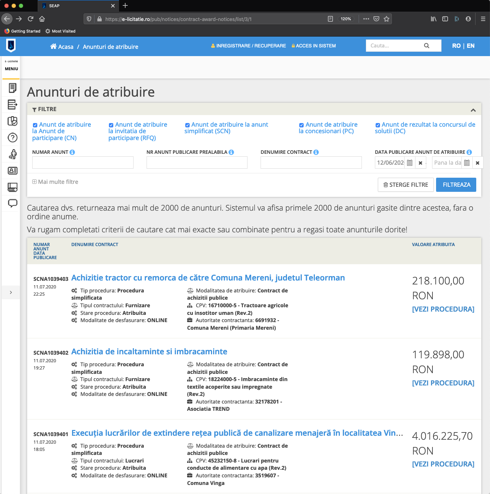

# sicap-parser

**sicap-parser** este un utilitar pentru a extrage informatiile despre licitatiile publice si achizitiile directe din portalul SEAP/SICAP si a le indexa in Elasticsearch

Pentru vizualizarea datelor foloseste tutorialul de [aici](https://github.com/ciocan/sicap-explorer)

**Mod de utilizare:**

```bash
➜  sicap-parser git:(master) ✗ sicap-parser --help
sicap-parser [command]

Commands:
  sicap-parser achizitii  Indexeaza achizitiile directe
  sicap-parser licitatii  Indexeaza licitatiile publice

Options:
  --help     Show help                                                 [boolean]
  --version  Show version number                                       [boolean]

➜  sicap-parser git:(master) ✗ sicap-parser licitatii --help
sicap-parser licitatii

Indexeaza licitatiile publice

Options:
  --help             Show help                                         [boolean]
  --version          Show version number                               [boolean]
  --date, -d         Data in format zz-ll-aaaa               [string] [required]
  --host, -h         Url Elasticsearch (default localhost:9200)
                                     [string] [default: "http://localhost:9200"]
  --index, -i        Indexul Elasticsearch folosit pentru licitatiile publice
                     (default licitatii-publice)
                                         [string] [default: "licitatii-publice"]
  --concurrency, -c  Numarul de accesari concurente spre siteul SEAP (default 5)
                                                           [number] [default: 5]
  --archive, -a      foloseste arhiva istorica (baza de date 2007-218)
                                                      [boolean] [default: false]
```

Instalare:

```bash
git clone git@github.com:ciocan/sicap-parser.git
npm install
npm run build
npm link
```

_Nota: Node.js versiunea 14 este necesara pentru a functiona_

Exemple in actiune:


**Consideratii tehnice:**

Informatiile sunt descarcate folosind 3 api-uri:

http://e-licitatie.ro/api-pub/NoticeCommon/GetCANoticeList/

GetCANoticeList este folosit pentru a obtine lista cu informatii pe scurt despre licitatii.



http://e-licitatie.ro/api-pub/C_PUBLIC_CANotice/get/123456

**C_PUBLIC_CANotice** obtine informatii despre autoritatea contractanta si detaliile ofertei

123456 reprezinta id-ul de legatura codificat intern ca si **caNoticeId**

http://e-licitatie.ro/api-pub/C_PUBLIC_CANotice/GetCANoticeContracts

**GetCANoticeContracts** este folosit pentru a obtine informatii despre firmele castigatoare

**<u>Nota 1:</u>** pentru a accesa arhiva istorica cu baza de date din perioada 2007-2018 se folosesc link-urile:

http://istoric.e-licitatie.ro/api-pub/NoticeCommon/GetCANoticeList/

http://istoric.e-licitatie.ro/api-pub/C_PUBLIC_CANotice/get/123456

http://istoric.e-licitatie.ro/api-pub/C_PUBLIC_CANotice/GetCANoticeContracts

<u>**Nota 2:**</u> datele rezultate contin mult mai multe informatii care nu sunt relevante (tot felul de id-uri de sistem sau prametrii). Aceste informatii sunt omise si nu sunt salvate in Elastic search.

<u>**Nota 3:**</u> de asemenea rezultatele obtinute contin informatii personale (nume, telefon email, etc) a persoanele responsabile de contracte. Colectarea acestor informatii cu caracter personal incalca regulamentul european privind protectia datelor (**GDPR**), in consecinta ele nu sunt salvate in Elastic search.

Pentru a vedea exact cum sunt transformate raspunsurile primite vezi codul sursa din **[src/transformers.js](src/transformers.js)**

Daca vrei sa accesezi api-urile intr-un mod mai usor poti folosi [Postman](https://www.postman.com/) importand [colectia](./data/postman-collection.json) special special exportata.

Pentru a salva timp si latime de banda poti instala [sicap-explorer](https://github.com/ciocan/sicap-explorer) - contine tutorial cum sa importi in Elasticsearch [arhiva salvata](https://github.com/ciocan/sicap-explorer/blob/master/arhiva-sicap.torrent) ce contine 470k licitatii publice si 22m achizitii directe din periada 2007- iulie 2020.

```bash
elasticdump \
  --input=./licitatii-publice.json \
  --output=http://localhost:9200 \
```

**Nota 4:** Informatiile despre licitatiile publice (mai putin cele cu caracter personal) sunt informatii de natura publica si orice persoana are dreptul sa le prelucreze asa cum doreste. Datele sunt preluate din portalul de licitatii publice SEAP/SICAP în baza **Licenței pentru Guvernare Deschisa v1.0**

Acest proiect adopta principiile [Public Money / Public Code](https://publiccode.eu/) si doreste ca institutiile publice sa ofere access catre informatiile cu caracter public intr-un mod cat mai usor.

[](https://publiccode.eu/)
